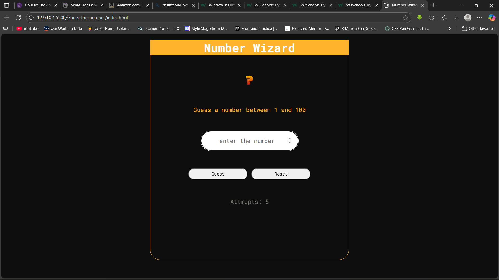
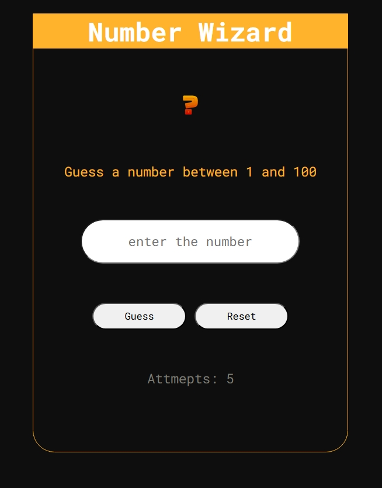

- [Overview](#overview)
  - [Screenshot](#screenshot)
  - [Links](#links)
- [My process](#my-process)
  - [Built with](#built-with)
  - [What I learned](#what-i-learned)
- [Author](#author)

# **Overview**
This guess my number game is to help me navigate my journey through the land of JavaScript. It help me solidify my understanding in `logical operators`and `Math.random()` functions. To make the game fun I, the player has 5 attempts to guess the random number. Failure to do so, you'll lose the game. If you guess it correctly you win. The `guess button` checks if the typed number equals the hidden number and `reset button` restarts the game.

# **Screenshot**

# **Built with**
HTML
CSS
JS

# **Author**
Emmanuel Akwaboah
